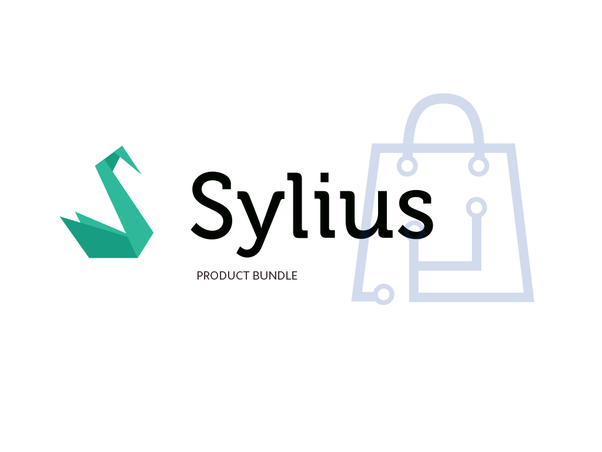

<h1 align="center">
    <a href="http://bitbag.shop" target="_blank">
        
    </a>
    <br />
    <a href="https://packagist.org/packages/bitbag/product-bundle-plugin" title="License" target="_blank">
        
    </a>
    <a href="https://packagist.org/packages/bitbag/product-bundle-plugin" title="Total Downloads" target="_blank">
        
    </a>
    <p>
        <a href="https://sylius.com/plugins/" target="_blank">
            
        </a>
    </p>
</h1>

## About us

At BitBag we do believe in open source. However, we are able to do it just because of our awesome clients, who are kind enough to share some parts of our work with the community. Therefore, if you feel like there is a possibility for us working together, feel free to reach us out. You will find out more about our professional services, technologies and contact details at https://bitbag.io/.

## Overview

This plugin allows you to create new products by bundling existing products together.

## Installation

1. Require plugin with composer:

    ```bash
    composer require bitbag/product-bundle-plugin
    ```
 
2. Add plugin dependencies to your `config/bundles.php` file:
    
    ```php
        return [
         ...
        
            BitBag\SyliusProductBundlePlugin\BitBagSyliusProductBundlePlugin::class => ['all' => true ],
        ];
    ```

3. Import required config in your `config/packages/_sylius.yaml` file:
    
    ```yaml
    # config/packages/_sylius.yaml
    
    imports:
        ...
        
        - { resource: "@BitBagSyliusProductBundlePlugin/Resources/config/config.yml" }
    ```    

4. Import routing in your `config/routes.yaml` file:
    
    ```yaml
    
    # config/routes.yaml
    ...
    
    bitbag_sylius_product_bundle_plugin:
        resource: "@BitBagSyliusProductBundlePlugin/Resources/config/routing.yml"
    ```

5. Extend `Product`(including Doctrine mapping):

    ```php
    <?php 
   
   declare(strict_types=1);
    
    namespace App\Entity\Product;
    
    use BitBag\SyliusProductBundlePlugin\Entity\ProductBundlesAwareInterface;
    use BitBag\SyliusProductBundlePlugin\Entity\ProductBundlesAwareTrait;
    use Sylius\Component\Core\Model\Product as BaseProduct;

    class Product extends BaseProduct implements ProductBundlesAwareInterface
    {
        use ProductBundlesAwareTrait;  
    }
    ```

   Mapping (Annotations) - Override bundle trait, by create new one and use it in Entity/Product/Product . 

   ```php
   use BitBag\SyliusProductBundlePlugin\Entity\ProductBundleInterface;
   use BitBag\SyliusProductBundlePlugin\Entity\ProductBundlesAwareTrait;
   trait ProductTrait
   {
       use ProductBundlesAwareTrait;
   
       /**
        * @var ProductBundleInterface
        * @ORM\OneToOne(
        *     targetEntity="BitBag\SyliusProductBundlePlugin\Entity\ProductBundleInterface",
        *     mappedBy="product",
        *     cascade={"all"},)
        */
       protected $productBundle;
   
   }
   ```

   Mapping (XML):
   
   ```xml
   # Resources/config/doctrine/Product.Product.orm.xml
   
   <?xml version="1.0" encoding="UTF-8"?>
   <doctrine-mapping xmlns="http://doctrine-project.org/schemas/orm/doctrine-mapping"
                     xmlns:xsi="http://www.w3.org/2001/XMLSchema-instance"
                     xsi:schemaLocation="http://doctrine-project.org/schemas/orm/doctrine-mapping
                                         http://doctrine-project.org/schemas/orm/doctrine-mapping.xsd"
   >
       <entity name="App\Entity\Product\Product" table="sylius_product">
           <one-to-one field="productBundle" target-entity="BitBag\SyliusProductBundlePlugin\Entity\ProductBundleInterface" mapped-by="product">
               <cascade>
                   <cascade-all/>
               </cascade>
           </one-to-one>
       </entity>
   </doctrine-mapping>
   ```
   
6. Extend `OrderItem` (including Doctrine mapping):

    ```php
   <?php
   
   declare(strict_types=1);
   
   namespace App\Entity\Order;
   
   use BitBag\SyliusProductBundlePlugin\Entity\OrderItemInterface;
   use BitBag\SyliusProductBundlePlugin\Entity\ProductBundleOrderItemsAwareTrait;
   use Sylius\Component\Core\Model\OrderItem as BaseOrderItem;
   
   class OrderItem extends BaseOrderItem implements OrderItemInterface
   {
   
       use ProductBundleOrderItemsAwareTrait;
   
       public function __construct()
       {
           parent::__construct();
           $this->init();
       }
   
   }
    ```
   Mapping (Annotations) - Override bundle trait, by create new one and use it in Entity/Order/OrderItem .

   ```php
   use BitBag\SyliusProductBundlePlugin\Entity\ProductBundleOrderItemInterface;
   use BitBag\SyliusProductBundlePlugin\Entity\ProductBundleOrderItemsAwareTrait;
   
   trait OrderItemTrait
   {
       use ProductBundlesAwareTrait;
   
        /**
        * @var ProductBundleInterface
        * @ORM\OneToMany(
        *     targetEntity="BitBag\SyliusProductBundlePlugin\Entity\ProductBundleOrderItemInterface",
        *     mappedBy="orderItem",
        *     cascade={"all"},)
        */
       protected $productBundleOrderItems;
   
   }
   ```
   Mapping (XML):
   
   ```xml
   # Resources/config/doctrine/Order.OrderItem.orm.xml

   <?xml version="1.0" encoding="UTF-8"?>
   <doctrine-mapping xmlns="http://doctrine-project.org/schemas/orm/doctrine-mapping"
                     xmlns:xsi="http://www.w3.org/2001/XMLSchema-instance"
                     xsi:schemaLocation="http://doctrine-project.org/schemas/orm/doctrine-mapping
                                         http://doctrine-project.org/schemas/orm/doctrine-mapping.xsd"
   >
       <entity name="App\Entity\Order\OrderItem" table="sylius_order_item">
           <one-to-many field="productBundleOrderItems" target-entity="BitBag\SyliusProductBundlePlugin\Entity\ProductBundleOrderItem" mapped-by="orderItem" >
               <cascade>
                   <cascade-all/>
               </cascade>
           </one-to-many>
       </entity>
   </doctrine-mapping>
   ```

7. Add configuration for extended product, order item and product variant repository:

    ```yaml
    # config/packages/_sylius.yaml
   
    sylius_product:
        resources:
            product:
                classes:
                    model: App\Entity\Product\Product
            product_variant:
                classes:
                    repository: BitBag\SyliusProductBundlePlugin\Repository\ProductVariantRepository
   sylius_order:
       resources:
           order_item:
               classes:
                   model: App\Entity\Order\OrderItem
    
    ```

8. Add 'Create/Bundle' to product grid configuration:

    ```yaml
    # config/packages/_sylius.yaml
    
    sylius_grid:
       grids:
           sylius_admin_product:
               actions:
                   main:
                       create:
                           type: links
                           label: sylius.ui.create
                           options:
                               class: primary
                               icon: plus
                               header:
                                   icon: cube
                                   label: sylius.ui.type
                               links:
                                   simple:
                                       label: sylius.ui.simple_product
                                       icon: plus
                                       route: sylius_admin_product_create_simple
                                   configurable:
                                       label: sylius.ui.configurable_product
                                       icon: plus
                                       route: sylius_admin_product_create
                                   bundle:
                                       label: bitbag_sylius_product_bundle.ui.bundle
                                       icon: plus
                                       route: bitbag_product_bundle_admin_product_create_bundle
       
    ```
8. If you have full configuration in xml override doctrine config : 

    ```yaml
    # config/packages/doctrine.yaml   
    
    mappings:
            App:
                is_bundle: false
                type: xml
                dir: '%kernel.project_dir%/src/Resources/config/doctrine'
                prefix: 'App\Entity'
                alias: App
   
    
    ``` 
   
9. Finish the installation by updating the database schema and installing assets:

    ```
    $ bin/console doctrine:migrations:diff
    $ bin/console doctrine:migrations:migrate
    ```

## Testing
```bash
$ composer install
$ cd tests/Application
$ yarn install
$ yarn build
$ bin/console assets:install public -e test
$ bin/console doctrine:schema:create -e test
$ bin/console server:run 127.0.0.1:8080 -d public -e test
$ open http://localhost:8080
$ vendor/bin/behat
```

## Contribution

Learn more about our contribution workflow on http://docs.sylius.org/en/latest/contributing/.
