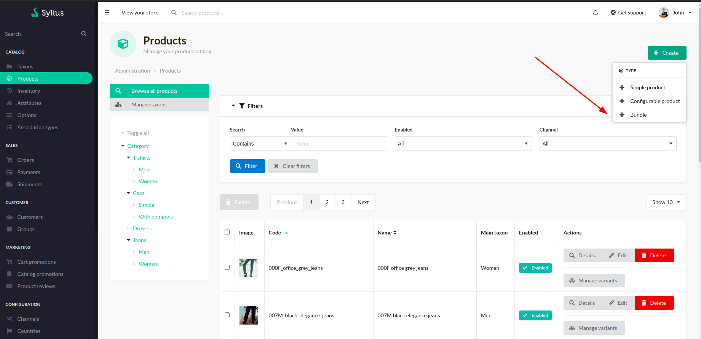
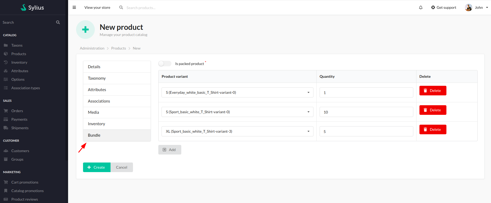
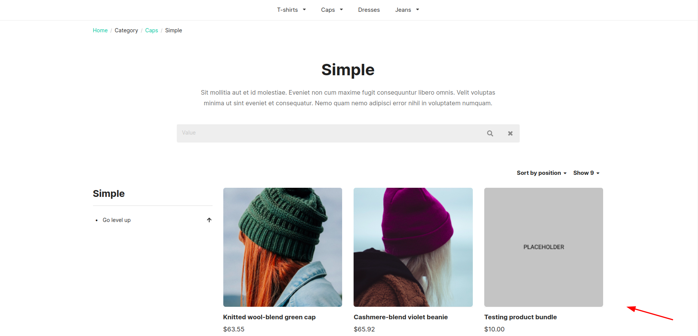
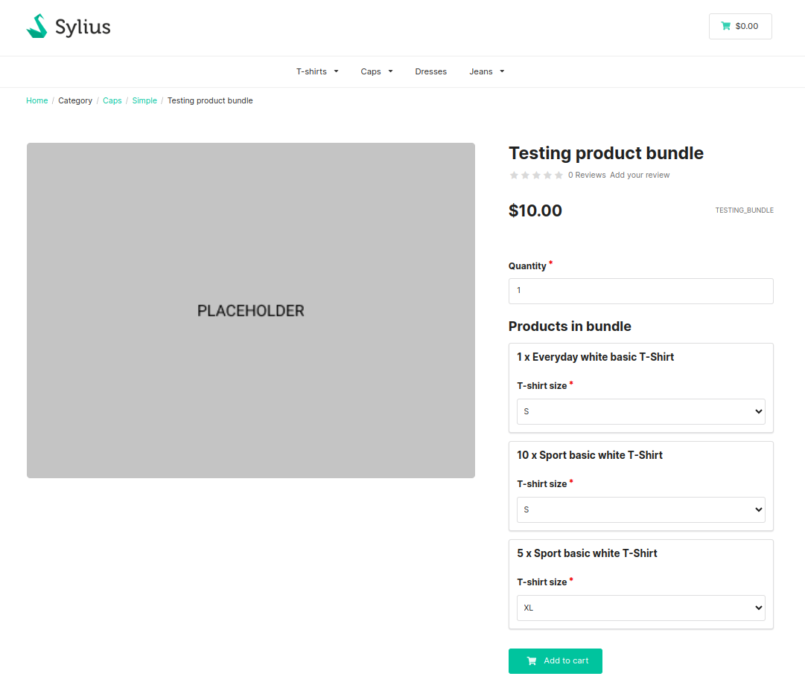
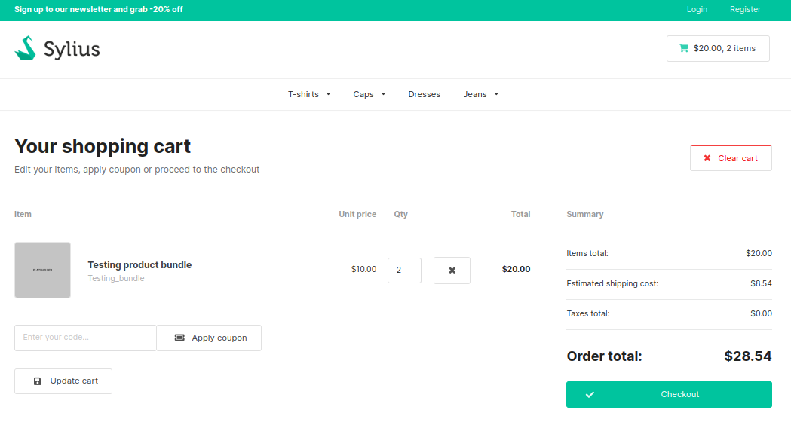

# Functionalities

---
**Bundles**

The plugin gives the user the opportunity to create bundles that contain more than product from the store. Creating a bundle is possible in the admin panel in the Products section. 

    

After choosing the right option, the user is taken to the bundle creation page. All the sections are just the same as for the normal products. However, there is a section that is unique for the plugin and it is Bundle section. 

    

In there user can add chosen variants of the products to the bundle and decide what should be their quantity per bundle. 

After setting all the other required info, taxonomy and enabling the bundle in the chosen channel, the user can buy the bundle in the shop.

    

    

    

